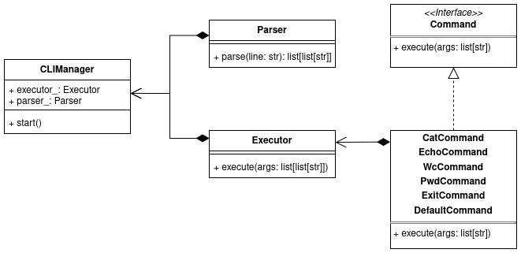

# Архитектура

## Описание

* `CLIManager`
  * Управляет интерпретатором, запускает парсинг и исполнение команд
* `Parser`
  * Парсит входную строку на токены, учитывая заданные требования
  * Результат функции `parse` - список списков. Каждый из списков - команда, разделенная на токены, команды разделены пайплайном. Например:
    * `parse("echo 123") -> [["echo", "123"]]`
    * `parse("echo 123 | wc") -> [["echo", "123"], ["wc"]]`
* `Executor`
  * Получает команды из `Parser` и выполняет их
  * Для этого используются:
    * `Command`
      * Интерфейс для известных команд
      * `execute(args: list[str])` - функция для исполнения команды, разбитой на токены
    * Для известных команд (`cat, echo, wc, pwd, exit`) есть соответствующие классы, реализующие интерфейс `Command` (например, `CatCommand`)
    * Для неизвестных команд класс `DefaultCommand`, который исполняет эту команду как внешнюю программу
  * Для осуществления работы с пайплайнами используются `fork()` и `pipe`
